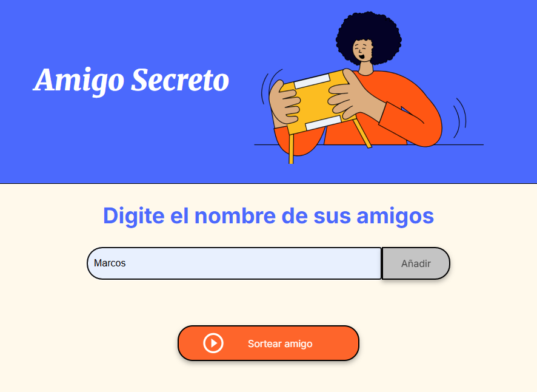
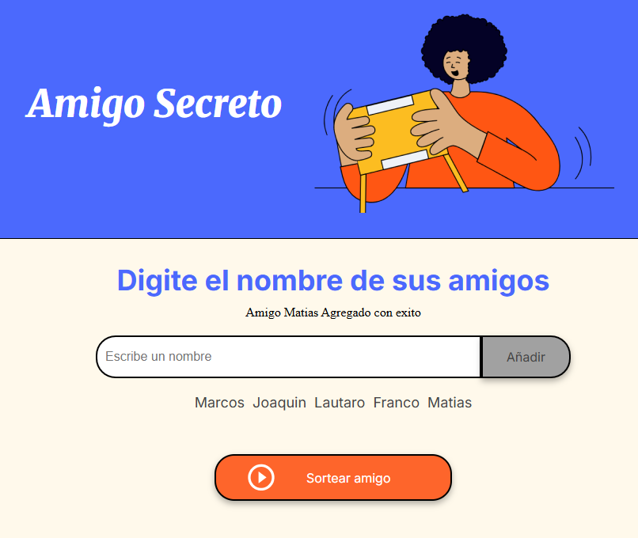
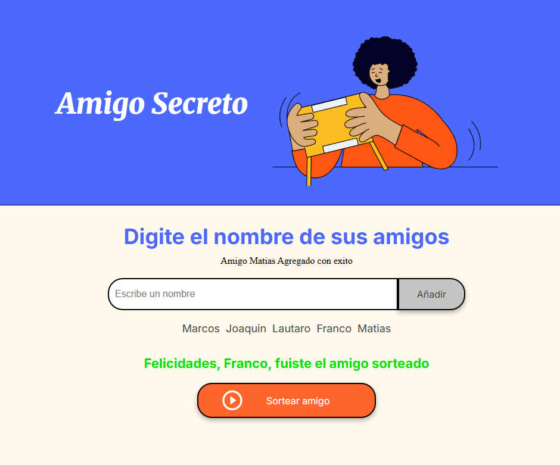

     
 

# 🎉 Sorteo de Amigos

Este es un proyecto simple en **JavaScript** cuyo objetivo es practicar y mejorar la lógica de programación.  
La aplicación permite ingresar nombres de amigos en una lista y luego realizar un sorteo aleatorio para elegir al "amigo ganador".  

## 🚀 Funcionalidades

- **Agregar amigos:**  
  Permite ingresar nombres en un campo de texto.  
  - No se aceptan nombres vacíos.  
  - No se aceptan nombres repetidos.  
  - Solo se permiten letras (sin números ni espacios).

- **Visualización de la lista:**  
  Cada amigo agregado se muestra dinámicamente en una lista.

- **Sorteo aleatorio:**  
  Al presionar el botón de sortear, se elige un amigo al azar y se muestra en pantalla.

## 📂 Estructura del proyecto

El proyecto se compone principalmente de:
- **HTML:** Estructura básica con un input para ingresar nombres, una lista para mostrarlos y un área para el resultado.  
- **CSS (opcional):** Para darle estilo a la página.  
- **JavaScript:** Toda la lógica de validación, agregado de amigos y sorteo.

## 📸 Ejemplo de uso

1. Escribí un nombre en el input.  
2. Presioná "Agregar".  
3. Repetí el proceso con varios amigos.  
4. Hacé clic en "Sortear" para ver quién fue el elegido 🎊.  

### Vista previa

  
  
  

## 🛠️ Tecnologías utilizadas

- **JavaScript**  
- **HTML5**  
- **CSS3**
